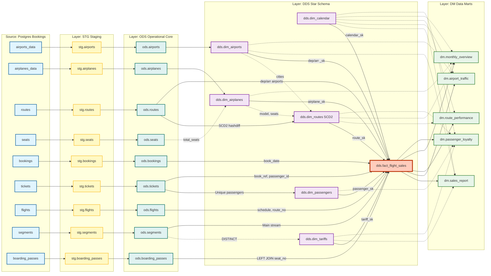

# Схема БД DWH (Bookings → Greenplum)

> **Статус:** Все слои реализованы в ветке `solution` (STG, ODS, DDS, DM).
> На ветке `main` студенческие таблицы ODS (`airplanes`, `seats`), DDS-измерения
> (`dim_airplanes`, `dim_passengers`, `dim_routes`) и студенческие DM-витрины
> (`airport_traffic`, `route_performance`, `monthly_overview`, `passenger_loyalty`)
> — заглушки (`SELECT 1;`). Данные появятся после реализации заданий.

Архитектура хранилища данных (DWH) для учебного проекта Airflow + Greenplum.
Источник — демо-БД `bookings` (Postgres). Документ даёт цельный взгляд «сверху»;
детали реализации — в дизайн-документах слоёв.

---

## Полная схема потоков данных (Data Lineage)

---

## Сводка объектов по слоям

### STG (Staging)

Сырые данные из источника, все бизнес-поля как TEXT. Хранение: AO Row (zstd).
Служебные поля: `event_ts`, `_load_ts`, `_load_id`.

| Таблица | Источник (PXF) | Ключ | Стратегия загрузки | Distribution |
|---------|---------------|------|-------------------|--------------|
| `stg.bookings` | `bookings.bookings` | `book_ref` | Инкремент (book_date) | `book_ref` |
| `stg.tickets` | `bookings.tickets` | `ticket_no` | Инкремент (через bookings) | `book_ref` |
| `stg.flights` | `bookings.flights` | `flight_id` | Инкремент (scheduled_departure) | `flight_id` |
| `stg.segments` | `bookings.segments` | `(ticket_no, flight_id)` | Инкремент (через tickets) | `ticket_no` |
| `stg.boarding_passes` | `bookings.boarding_passes` | `(ticket_no, flight_id)` | Инкремент (через tickets/bookings) | `ticket_no` |
| `stg.airports` | `bookings.airports_data` | `airport_code` | Full snapshot | `airport_code` |
| `stg.airplanes` | `bookings.airplanes_data` | `airplane_code` | Full snapshot | `airplane_code` |
| `stg.routes` | `bookings.routes` | `(route_no, validity)` | Full snapshot | `route_no` |
| `stg.seats` | `bookings.seats` | `(airplane_code, seat_no)` | Full snapshot | `airplane_code` |

Детали: [`bookings_stg_design.md`](bookings_stg_design.md)

### ODS (Operational Data Store)

Очищенные данные с корректными типами. Справочники: AO Row (TRUNCATE+INSERT).
Транзакции: Heap (SCD1 UPSERT). Служебные поля: `_load_id`, `_load_ts`,
`event_ts` (для транзакционных таблиц).

| Таблица | Стратегия | Storage | Ключевые преобразования |
|---------|-----------|---------|------------------------|
| `ods.bookings` | SCD1 UPSERT (HWM) | Heap | `total_amount` TEXT → NUMERIC |
| `ods.tickets` | SCD1 UPSERT (HWM) | Heap | `outbound` TEXT → BOOLEAN |
| `ods.flights` | SCD1 UPSERT (HWM) | Heap | TEXT → INTEGER, TIMESTAMP WITH TIME ZONE |
| `ods.segments` | SCD1 UPSERT (HWM) | Heap | `price` TEXT → `amount` NUMERIC |
| `ods.boarding_passes` | SCD1 UPSERT (HWM) | Heap | `boarding_no` TEXT → INTEGER |
| `ods.airports` | TRUNCATE+INSERT | AO Row | JSON → отдельные поля (`airport_name`, `city`) |
| `ods.airplanes` | TRUNCATE+INSERT | AO Row | `range`/`speed` TEXT → INTEGER |
| `ods.routes` | TRUNCATE+INSERT | AO Row | `days_of_week` → INTEGER[], `scheduled_time` → TIME |
| `ods.seats` | TRUNCATE+INSERT | AO Row | Без преобразований |

Детали: [`bookings_ods_design.md`](bookings_ods_design.md)

### DDS (Detailed Data Store — Star Schema)

Измерения с суррогатными ключами. Факт в центре звезды.
SK генерация: `MAX(sk) + ROW_NUMBER()` (безопасно при `concurrency=1`).

#### Измерения

| Измерение | BK | SK | SCD | Storage | Источник |
|-----------|----|----|-----|---------|----------|
| `dim_calendar` | `date_actual` | `calendar_sk` | Static | AO Row | Генерация (2016–2030) |
| `dim_airports` | `airport_bk` | `airport_sk` | SCD1 | Heap | `ods.airports` |
| `dim_airplanes` | `airplane_bk` | `airplane_sk` | SCD1 | Heap | `ods.airplanes` + `ods.seats` (total_seats) |
| `dim_tariffs` | `fare_conditions` | `tariff_sk` | SCD1 | AO Row | `ods.segments` (DISTINCT) |
| `dim_passengers` | `passenger_id` | `passenger_sk` | SCD1 | Heap | `ods.tickets` (дедупликация) |
| `dim_routes` | `route_bk` | `route_sk` | **SCD2** | Heap | `ods.routes` + `dim_airports` + `dim_airplanes` |

#### Факт

`dds.fact_flight_sales` — зерно: 1 строка = 1 сегмент билета (`ticket_no` + `flight_id`).

| FK | Lookup-путь | Примечание |
|----|-------------|------------|
| `calendar_sk` | `dim_calendar` | Дата вылета |
| `departure_airport_sk` | `ods.routes` → `dim_airports` | Аэропорт вылета (эталонный справочник) |
| `arrival_airport_sk` | `ods.routes` → `dim_airports` | Аэропорт прилёта (эталонный справочник) |
| `airplane_sk` | `dim_routes` → `dim_airplanes` | Самолёт (point-in-time SCD2) |
| `tariff_sk` | `dim_tariffs` | Тариф |
| `passenger_sk` | `dim_passengers` | Пассажир |
| `route_sk` | `dim_routes` | Версия маршрута (SCD2, point-in-time) |

Метрики: `price` (NUMERIC), `is_boarded` (BOOLEAN).
Degenerate keys: `book_ref`, `ticket_no`, `flight_id`, `book_date`, `seat_no`.

Детали: [`bookings_dds_design.md`](bookings_dds_design.md)

### DM (Data Marts — Витрины)

Аналитические витрины поверх DDS. Каждая отвечает на конкретный бизнес-вопрос.

| Витрина | Бизнес-вопрос | Зерно | Стратегия | Storage |
|---------|--------------|-------|-----------|---------|
| `dm.sales_report` | Выручка и boarding rate по направлениям/тарифам/дням | (flight_date, dep_sk, arr_sk, tariff_sk) | UPSERT (HWM) | Heap |
| `dm.airport_traffic` | Пассажиропоток аэропортов по дням | (traffic_date, airport_sk) | UPSERT (HWM) | Heap |
| `dm.route_performance` | Эффективность маршрутов за всё время | route_bk | Full Rebuild | AO Column (zstd) |
| `dm.monthly_overview` | Помесячная динамика по типам самолётов | (year, month, airplane_sk) | UPSERT (HWM) | Heap |
| `dm.passenger_loyalty` | Профиль лояльности пассажиров | passenger_sk | UPSERT (затронутые ключи) | Heap |

Детали: [`bookings_dm_design.md`](bookings_dm_design.md)

---

## Ключевые договорённости

- **Нейминг полей**: [`naming_conventions.md`](naming_conventions.md)
- **DQ-проверки**: SQL-скрипты с `RAISE EXCEPTION` (не отдельный DQ-слой).
  На ветке `main` студенческие DQ-скрипты (`airplanes_dq.sql`, `seats_dq.sql`,
  student dims/DM) — заглушки (`SELECT 1;`) без проверок.
- **Инкремент STG**: для `tickets` опорная дата — из `bookings.book_date`
- **Point-in-time JOIN**: факт ↔ `dim_routes` по `[valid_from, valid_to)`
- **Суррогатные ключи**: `MAX(sk) + ROW_NUMBER()` (не SERIAL — GP-специфика)

---

## Обучающие материалы

### Глоссарий

| Термин | Объяснение |
|--------|-----------|
| **Зерно факта (Fact Grain)** | Минимальная единица в факте. Здесь — один сегмент билета. |
| **Суррогатный ключ (SK)** | Технический INT-ключ, генерируемый в DWH. |
| **Бизнес-ключ (BK)** | Ключ из источника (`airport_code`, `passenger_id`). |
| **Star Schema** | Факт в центре, измерения вокруг (без snowflake-подтаблиц). |
| **SCD Type 1** | Перезапись атрибутов без истории. |
| **SCD Type 2** | Версионирование: `valid_from`/`valid_to`, `hashdiff`. |
| **AO Row/Column** | Append-Only хранение (Row или Column). Не поддерживает UPDATE. |
| **Heap** | Стандартное хранение с поддержкой UPDATE/DELETE. |
| **HWM (High Water Mark)** | Отсечка по `MAX(_load_ts)` для инкрементальной загрузки. |

### На что обратить внимание

**Обогащение измерений:**
`seats` + `airplanes` → `dim_airplanes` — пример обогащения (total_seats).

**«Майнинг» измерений из транзакций:**
`tickets` → `dim_passengers` — в источнике нет таблицы «Пассажиры». Извлекаем
уникальных пассажиров из билетов с дедупликацией.

**Нормализация:**
`segments.fare_conditions` → `dim_tariffs` — выносим строковый атрибут в отдельный
справочник для компактного INT-ключа в факте.

**Почему нет `dim_bookings`:**
`bookings` — транзакция, не справочник. `book_ref` и `book_date` хранятся
как degenerate keys в факте.

**Point-in-time JOIN (SCD2):**
Факт присоединяется к той версии маршрута, которая действовала на дату вылета:
`scheduled_departure::DATE >= valid_from AND (valid_to IS NULL OR ... < valid_to)`.

---

## Связанные документы

- [`bookings_stg_design.md`](bookings_stg_design.md) — дизайн STG
- [`bookings_ods_design.md`](bookings_ods_design.md) — дизайн ODS (SCD1, batch contract, DQ)
- [`bookings_dds_design.md`](bookings_dds_design.md) — дизайн DDS (Star Schema, SCD2)
- [`bookings_dm_design.md`](bookings_dm_design.md) — дизайн DM (5 витрин)
- [`naming_conventions.md`](naming_conventions.md) — нейминг полей
- [`../reference/bookings_tz.md`](../reference/bookings_tz.md) — часовые пояса
- [`../reference/pxf_bookings.md`](../reference/pxf_bookings.md) — настройка PXF
- [`../assignment/analyst_spec.md`](../assignment/analyst_spec.md) — ТЗ от аналитика (курсовое задание)
