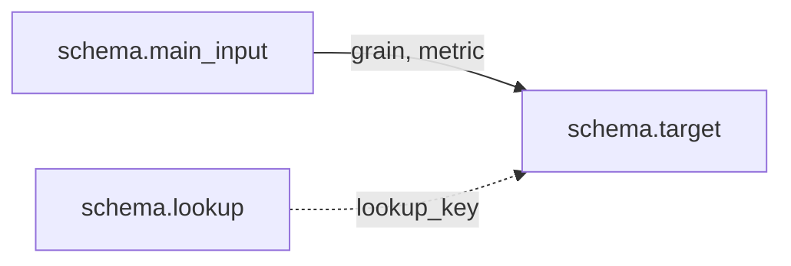

# Как читать пайплайн по скрипту загрузки

Большую схему не нужно запоминать. Связи любой таблицы уже записаны в блоке
`FROM ... JOIN ...` её файла `*_load.sql`. Обычно каждая прочитанная таблица
даёт одно входящее ребро. Если одна таблица читается под разными псевдонимами,
как `dim_airports`, её можно показать одним узлом.

## Метод

`INNER JOIN` показывает обязательную часть основного потока. Если входной строки
нет, целевая строка не появится. `LEFT JOIN` к измерениям решает две задачи.
Факт может прийти раньше измерения: это опаздывающее измерение
(late-arriving dimension). Эталонный факт также не должен зависеть от того,
успел ли студент реализовать свои измерения. Поэтому строка факта сохраняется,
а её суррогатный ключ пока может быть `NULL`.

В этом CTE есть и другие `LEFT JOIN`. `ods.routes` даёт эталонный путь к
аэропортам, а `ods.boarding_passes` содержит необязательные `seat_no` и
признак посадки.

Если в загрузчике несколько SQL-операторов, смотрите на источник `INSERT`.
Именно он задаёт полный список входящих связей для новых строк. Например, в
`fact_flight_sales_load.sql` блок `FROM` у `UPDATE` читает только изменяемые
поля, а полный список находится в CTE `fact_src` перед `INSERT`.

## Пример: `fact_flight_sales`

Откройте [`sql/dds/fact_flight_sales_load.sql`](../../sql/dds/fact_flight_sales_load.sql)
и пройдите `fact_src` сверху вниз:

1. `FROM ods.segments` задаёт зерно `(ticket_no, flight_id)` и поле `price`.
2. `JOIN ods.tickets` обязателен для `book_ref` и `passenger_id`.
3. `JOIN ods.bookings` обязателен для `book_date`.
4. `JOIN ods.flights` обязателен для расписания и `route_no`.
5. `LEFT JOIN ods.routes` находит аэропорты по `route_no`. Этот эталонный путь
   не зависит от студенческого `dim_routes`.
6. `LEFT JOIN dds.dim_routes` ищет point-in-time версию маршрута и `route_sk`.
7. `LEFT JOIN dds.dim_calendar` даёт `calendar_sk` по дате вылета.
8. Два `LEFT JOIN dds.dim_airports` дают ключи аэропортов вылета и прилёта.
   На схеме их можно показать одним узлом `dim_airports`.
9. `LEFT JOIN dds.dim_airplanes` даёт `airplane_sk` через найденную версию маршрута.
10. `LEFT JOIN dds.dim_tariffs` даёт `tariff_sk`.
11. `LEFT JOIN dds.dim_passengers` даёт `passenger_sk`.
12. `LEFT JOIN ods.boarding_passes` даёт `seat_no` и признак `is_boarded`.

Так список связей превращается в [схему «Как собирается факт?»](db_schema.md#как-собирается-факт):
четыре обязательных входа рисуются сплошными стрелками, а остальные пунктирными.

## Как проверить свой слой

- Выпишите все таблицы из `FROM` и `JOIN` своего `*_load.sql`.
- Сравните список с эталонной схемой или дизайн-документом этого слоя.
- Проверьте служебные и SCD-поля по [`naming_conventions.md`](naming_conventions.md).
- Убедитесь, что рядом есть `*_dq.sql` и он покрывает нужные
  [классы DQ-проверок](../reference/dq_taxonomy.md).

## Шаблон схемы одной таблицы

Скопируйте шаблон и замените имена таблиц и полей:

