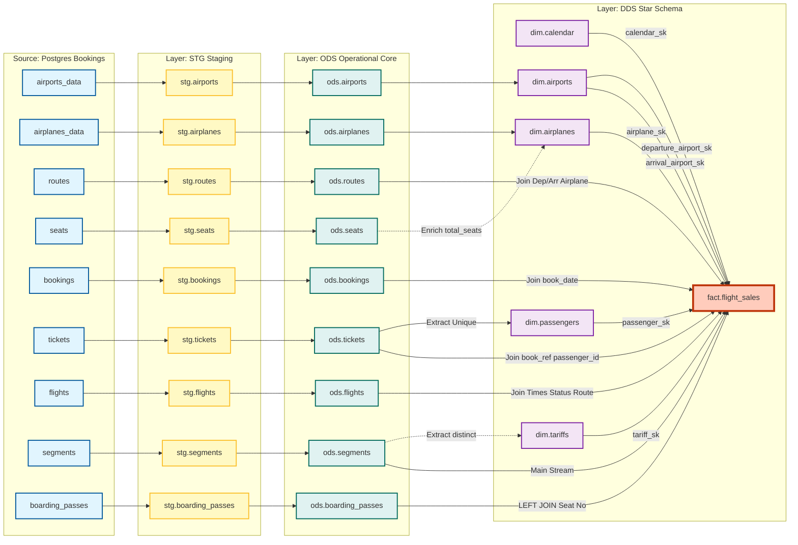

# Схема БД DWH (Bookings → Greenplum)

> **Статус:** Проект в разработке. Реализован STG слой полностью (все 9 таблиц).

## Обзор

Эта документация описывает архитектуру хранилища данных (DWH) для учебного проекта Airflow + Greenplum. Источник данных — демо-БД `bookings` (Postgres).

**Целевые аудитории:**
- **LLM/Разработчики**: Технические спецификации для реализации (см. раздел "Спецификации для реализации")
- **Студенты**: Обучающие материалы и пояснения (см. раздел "Обучающие материалы")

---

## Спецификации для реализации (для LLM и разработчиков)

### Ключевые договорённости

- **Источник**: используем основные таблицы схемы `bookings` (табличные данные, не `VIEW`)
- **Зерно факта `fact.flight_sales`**: 1 строка = 1 сегмент билета (`ticket_no` + `flight_id`, источник: `segments`)
- **Обязательная связь для аэропортов и самолёта**: `flights.route_no → routes → (departure_airport, arrival_airport, airplane_code)`
- **Даты**: как минимум различаем `book_date` (дата покупки) и `scheduled_departure` (дата/время вылета)
- **Инкремент в STG**: для `tickets` опорная дата берётся из `bookings.book_date`, потому что в `tickets` нет собственного поля времени изменения
- **DQ-проверки**: проверки качества данных выполняем SQL-скриптами, но **не сохраняем результаты в отдельные таблицы/слой DQ** (при проблемах падаем с понятной ошибкой и останавливаем пайплайн)

### Статус реализации по слоям

| Слой | Статус | Реализовано |
|------|--------|-------------|
| **Source** | ✅ Готово | Демо-БД bookings (Postgres) |
| **STG** | ✅ Готово | 9 из 9 таблиц (bookings, tickets, airports, airplanes, routes, seats, flights, segments, boarding_passes) |
| **ODS** | ❌ Не реализован | Планируется |
| **DDS** | ❌ Не реализован | Планируется |

### Архитектура слоёв

#### STG (Staging Layer)
- **Назначение**: Сырой слой, максимально близкий к источнику, без бизнес-логики
- **Хранение**: AO-Row (Append-Only Row-oriented) для эффективной загрузки больших объёмов
- **Типы данных**: Бизнес-колонки как `TEXT`, тех.колонки как `TIMESTAMP`
- **Инкрементальная загрузка**: Опорное поле `src_created_at_ts` (из `book_date` для tickets)
- **Технологические колонки**:
  - `src_created_at_ts TIMESTAMP` — дата/время из источника для инкремента
  - `load_dttm TIMESTAMP NOT NULL DEFAULT now()` — когда запись была загружена
  - `batch_id TEXT` — идентификатор пачки (рекомендуем `NOT NULL`, например `{{ ds_nodash }}` или `{{ run_id }}`)
- **DQ-проверки (после загрузки STG)**: отдельные SQL-скрипты, которые валидируют данные (counts, дубли, NULL, orphan records) и при ошибке делают `RAISE EXCEPTION`; примеры: `sql/stg/bookings_dq.sql`, `sql/stg/tickets_dq.sql`

#### ODS (Operational Data Store)
- **Назначение**: Очищенные данные в 3NF, готовые для аналитики
- **Хранение**: Heap для частых чтений и обновлений
- **Трансформации**: Очистка, приведение типов, нормализация
- **Связи**: Все связи через бизнес-ключи (без суррогатных ключей)

#### DDS (Data Delivery System)
- **Назначение**: Star Schema для аналитики и отчётности
- **Хранение**: Heap или AO-CO (Append-Only Column-oriented) для аналитических запросов
- **Структура**: Измерения (Dimensions) + Факты (Facts)
- **Ключи**: Суррогатные ключи (SK) для измерений, FK в фактах

### Измерения DDS (Dimensions)

| Измерение | Бизнес-ключ | Суррогатный ключ | Атрибуты |
|-----------|-------------|------------------|----------|
| `dim.calendar` | `date DATE` | `calendar_sk INT` | `year`, `month`, `day`, `day_of_week`, `is_holiday` (опционально) |
| `dim.airports` | `airport_code CHAR(3)` | `airport_sk INT` | `airport_name`, `city`, `timezone`, `coordinates` |
| `dim.airplanes` | `airplane_code CHAR(3)` | `airplane_sk INT` | `model`, `total_seats`, `range_km` |
| `dim.tariffs` | `fare_conditions TEXT` | `tariff_sk INT` | `fare_conditions` (Economy/Comfort/Business) |
| `dim.passengers` | `passenger_id TEXT` | `passenger_sk INT` | `passenger_name` (SCD Type 1) |

### Факт DDS (Fact)

`fact.flight_sales`:
- **Зерно**: 1 строка = 1 сегмент билета (`ticket_no` + `flight_id`)
- **FK на измерения**:
  - `calendar_sk` — ссылка на дату вылета
  - `departure_airport_sk` — аэропорт вылета
  - `arrival_airport_sk` — аэропорт прилёта
  - `airplane_sk` — самолёт
  - `tariff_sk` — тариф
  - `passenger_sk` — пассажир
- **Метрики**:
  - `price NUMERIC` — стоимость сегмента
  - `is_boarded BOOLEAN` — сел ли пассажир в самолёт (из boarding_passes)
- **Атрибуты**:
  - `book_ref TEXT` — бизнес-ключ бронирования
  - `book_date DATE` — дата покупки
  - `ticket_no TEXT` — номер билета
  - `flight_id INT` — ID рейса
  - `seat_no TEXT` — место (если есть)

---

### Детальное описание таблиц STG слоя

#### stg.bookings (транзакции, инкремент)
- **Источник:** `bookings.bookings` (через PXF)
- **Ключ распределения:** `book_ref`
- **Бизнес-колонки:**
  - `book_ref TEXT` - номер бронирования
  - `book_date TEXT` - дата бронирования
  - `total_amount TEXT` - общая сумма
- **Технические колонки:** `src_created_at_ts` (=book_date), `load_dttm`, `batch_id`
- **Стратегия загрузки:** Инкремент по `book_date`
- **DQ проверки:** count (окно инкремента), дубликаты book_ref, NULL обязательных полей

#### stg.tickets (транзакции, инкремент)
- **Источник:** `bookings.tickets` (через PXF)
- **Ключ распределения:** `ticket_no`
- **Бизнес-колонки:**
  - `ticket_no TEXT` - номер билета
  - `book_ref TEXT` - номер бронирования
  - `passenger_id TEXT` - идентификатор пассажира
  - `passenger_name TEXT` - имя пассажира
  - `contact_data TEXT` - контактные данные (JSONB)
- **Технические колонки:** `src_created_at_ts` (из book_date через bookings), `load_dttm`, `batch_id`
- **Стратегия загрузки:** Инкремент по `book_date` (через bookings)
- **DQ проверки:** count (окно инкремента), дубликаты ticket_no, NULL обязательных полей, ссылочная целостность

#### stg.airports (справочник, full load)
- **Источник:** `bookings.airports_data` (через PXF)
- **Ключ распределения:** `airport_code`
- **Бизнес-колонки:**
  - `airport_code TEXT` - код аэропорта
  - `airport_name TEXT` - название аэропорта (из JSONB)
  - `city TEXT` - город (из JSONB)
  - `country TEXT` - страна (из JSONB)
  - `coordinates TEXT` - координаты
  - `timezone TEXT` - часовой пояс
- **Технические колонки:** `src_created_at_ts`, `load_dttm`, `batch_id`
- **Стратегия загрузки:** Full load (все строки при каждом запуске)
- **DQ проверки:** count, дубликаты airport_code, NULL обязательных полей

#### stg.airplanes (справочник, full load)
- **Источник:** `bookings.airplanes_data` (через PXF)
- **Ключ распределения:** `airplane_code`
- **Бизнес-колонки:**
  - `airplane_code TEXT` - код самолёта
  - `model TEXT` - модель (из JSONB)
  - `range TEXT` - дальность полёта
  - `speed TEXT` - скорость
- **Технические колонки:** `src_created_at_ts`, `load_dttm`, `batch_id`
- **Стратегия загрузки:** Full load
- **DQ проверки:** count, дубликаты airplane_code, NULL обязательных полей

#### stg.routes (справочник, full load)
- **Источник:** `bookings.routes` (через PXF)
- **Ключ распределения:** `route_no`
- **Бизнес-колонки:**
  - `route_no TEXT` - номер маршрута
  - `validity TEXT` - период действия (из tstzrange)
  - `departure_airport TEXT` - аэропорт вылета
  - `arrival_airport TEXT` - аэропорт прилёта
  - `airplane_code TEXT` - код самолёта
  - `days_of_week TEXT` - дни недели (из int[])
  - `scheduled_time TEXT` - плановое время
  - `duration TEXT` - длительность
- **Технические колонки:** `src_created_at_ts`, `load_dttm`, `batch_id`
- **Стратегия загрузки:** Full load
- **DQ проверки:** count, дубликаты (route_no, validity), NULL обязательных полей, ссылочная целостность

#### stg.seats (справочник, full load)
- **Источник:** `bookings.seats` (через PXF)
- **Ключ распределения:** `airplane_code` (co-location с airplanes)
- **Бизнес-колонки:**
  - `airplane_code TEXT` - код самолёта
  - `seat_no TEXT` - номер места
  - `fare_conditions TEXT` - класс обслуживания
- **Технические колонки:** `src_created_at_ts`, `load_dttm`, `batch_id`
- **Стратегия загрузки:** Full load
- **DQ проверки:** count, дубликаты (airplane_code, seat_no), NULL обязательных полей, ссылочная целостность

#### stg.flights (транзакции, инкремент)
- **Источник:** `bookings.flights` (через PXF)
- **Ключ распределения:** `flight_id`
- **Бизнес-колонки:**
  - `flight_id TEXT` - идентификатор рейса
  - `route_no TEXT` - номер маршрута
  - `status TEXT` - статус
  - `scheduled_departure TEXT` - плановое время вылета
  - `scheduled_arrival TEXT` - плановое время прилёта
  - `actual_departure TEXT` - фактическое время вылета
  - `actual_arrival TEXT` - фактическое время прилёта
- **Технические колонки:** `src_created_at_ts` (=scheduled_departure), `load_dttm`, `batch_id`
- **Стратегия загрузки:** Инкремент по `scheduled_departure`
- **DQ проверки:** count (окно инкремента), дубликаты flight_id, NULL обязательных полей, ссылочная целостность

#### stg.segments (транзакции, инкремент)
- **Источник:** `bookings.segments` (через PXF)
- **Ключ распределения:** `ticket_no` (co-location с tickets)
- **Бизнес-колонки:**
  - `ticket_no TEXT` - номер билета
  - `flight_id TEXT` - идентификатор рейса
  - `fare_conditions TEXT` - класс обслуживания
  - `price TEXT` - цена
- **Технические колонки:** `src_created_at_ts` (из book_date через tickets), `load_dttm`, `batch_id`
- **Стратегия загрузки:** Инкремент по `book_date` (через tickets)
- **DQ проверки:** count (окно инкремента), дубликаты (ticket_no, flight_id), NULL обязательных полей, ссылочная целостность

#### stg.boarding_passes (транзакции, full snapshot)
- **Источник:** `bookings.boarding_passes` (через PXF)
- **Ключ распределения:** `ticket_no` (co-location с tickets/segments)
- **Бизнес-колонки:**
  - `ticket_no TEXT` - номер билета
  - `flight_id TEXT` - идентификатор рейса
  - `seat_no TEXT` - номер места
  - `boarding_no TEXT` - номер посадки
  - `boarding_time TEXT` - время посадки
- **Технические колонки:** `src_created_at_ts` (=now()), `load_dttm`, `batch_id`
- **Стратегия загрузки:** Full snapshot (все строки при каждом запуске)
- **DQ проверки:** count, дубликаты (ticket_no, flight_id), NULL обязательных полей, ссылочная целостность

---

## Полная схема потоков данных (Data Lineage)

---

## Обучающие материалы (для студентов)

### Глоссарий ключевых терминов

| Термин | Объяснение |
|--------|-----------|
| **Зерно факта (Fact Grain)** | Минимальная единица измерения в факте. Для `fact.flight_sales` — это один сегмент билета. |
| **Суррогатный ключ (Surrogate Key, SK)** | Технический ключ (обычно INT), который генерируется в DWH и не зависит от бизнес-ключа. |
| **Бизнес-ключ (Business Key)** | Ключ из источника (например, `airport_code`, `passenger_id`). |
| **Star Schema** | Модель данных, где факт в центре, а измерения вокруг него (как звезда). |
| **SCD Type 1** | Slowly Changing Dimension Type 1: при изменении данных просто перезаписываем старую запись. |
| **SCD Type 2** | Slowly Changing Dimension Type 2: при изменении данных создаём новую запись с датой начала/действия. |
| **AO-Row** | Append-Only Row-oriented: хранение данных по строкам, только добавление (без UPDATE/DELETE). |
| **Heap** | Обычное хранение данных (как в обычной таблице), поддерживает UPDATE/DELETE. |
| **Инкрементальная загрузка** | Загрузка только новых/изменённых данных за период, а не всей таблицы. |

### Пояснения к схеме

Эта диаграмма покрывает основные таблицы источника и показывает логику их трансформации. Вот на что стоит обратить внимание при обучении:

#### 1. Ветка справочников (Reference Data)

**`seats` + `airplanes` → `dim.airplanes`**: Здесь мы показываем пример **обогащения**. Таблица `seats` сама по себе в аналитике редко нужна отдельной сущностью. Мы используем её в ODS, чтобы посчитать общее количество мест (`total_seats`) и добавить это как атрибут в измерение самолётов (`dim.airplanes`).

**`airports` → `dim.airports`**: Простой перенос (1-в-1), но в DDS мы можем добавить, например, поле `city_ru` и `city_en` как отдельные колонки, убрав JSON, который есть в источнике.

#### 2. Ветка генерации измерений (Dimension Generation)

**`tickets` → `dim.passengers`**: Это самая сложная трансформация для измерения. В источнике нет таблицы "Пассажиры". Мы должны объяснить студентам, что мы "майним" пассажиров из билетов. Важно: один и тот же пассажир может иметь разные записи с разными именами (опечатки, изменение фамилии), поэтому в проде часто делают логику SCD Type 2 для отслеживания изменений.

- Для домашки (и первого эталонного решения) обычно достаточно **SCD Type 1**: одна актуальная запись на `passenger_id`, а SCD2 можно оставить как усложнение.

**`segments` → `dim.tariffs`**: Таблицы тарифов физически нет в источнике, она хранится строкой (`fare_conditions`: Economy/Comfort/Business) в таблице `segments`. Мы выносим её в отдельный справочник (нормализация), чтобы в факте хранить маленький `INT` ключ, а не длинную строку.

#### 3. Сборка Факта (`fact.flight_sales`)

Это центр звезды. Мы собираем его из шести ODS таблиц:

1. **`ods.segments`**: Основа (зерно факта — один полётный сегмент билета). Дает стоимость (`price`).
2. **`ods.tickets`**: Приджойниваем, чтобы получить `book_ref` и `passenger_id`.
3. **`ods.bookings`**: Приджойниваем по `book_ref`, чтобы получить `book_date` (дата покупки).
4. **`ods.flights`**: Приджойниваем, чтобы получить расписание/факт времени и статус рейса, а также `route_no` (связка на маршруты).
5. **`ods.routes`**: Приджойниваем по `route_no`, чтобы получить аэропорты вылета/прилёта и `airplane_code` (в `flights` этих полей нет напрямую).
6. **`ods.boarding_passes`**: Приджойниваем (LEFT JOIN), чтобы узнать, **сел ли пассажир реально в самолёт** и на какое место (`seat_no`). Это важный бизнес-аспект: билет куплен, но посадочный не выдан = пассажир не летел.

#### 4. Почему нет `dim.bookings`?

В классической Star Schema измерения — это справочники (airports, airplanes, passengers), а факты — транзакции/события (sales, bookings).

`bookings` — это транзакционная таблица, а не справочник. Вместо отдельного измерения `dim.bookings` мы храним:
- `book_ref` — бизнес-ключ бронирования (в факте)
- `book_date` — дата бронирования (в факте, берём из `ods.bookings` по `book_ref`)

Это позволяет отвечать на вопросы типа: *"За сколько дней до вылета люди обычно покупают билеты?"* (разница между `book_date` и датой вылета из `dim.calendar`).

#### 5. Суррогатные ключи (Surrogate Keys)

В Star Schema факт должен ссылаться на суррогатные ключи (SK) измерений, а не на бизнес-ключи:

| Бизнес-ключ | Суррогатный ключ | Преимущество |
|-------------|------------------|--------------|
| `airport_code CHAR(3)` | `airport_sk INT` | Меньший размер, стабильность |
| `airplane_code TEXT` | `airplane_sk INT` | Меньший размер, стабильность |
| `passenger_id TEXT` | `passenger_sk INT` | Меньший размер, отслеживание изменений |

---

## Связанные документы

- [`docs/internal/bookings_stg_design.md`](bookings_stg_design.md) — Детальный дизайн STG слоя для bookings
- [`docs/internal/bookings_stg_code_review.md`](bookings_stg_code_review.md) — Ревью решения и рекомендации по улучшению
- [`docs/internal/bookings_tz.md`](bookings_tz.md) — Работа с часовыми поясами в источнике
- [`docs/internal/pxf_bookings.md`](pxf_bookings.md) — Настройка PXF для чтения из bookings-db
- [`TESTING.md`](../../TESTING.md) — Пошаговый чек-лист для тестирования стенда

---

## История изменений

| Дата | Версия | Описание изменений |
|------|--------|-------------------|
| 2025-01-17 | 2.0 | Удалён слой DQ для упрощения учебного стенда. Добавлены спецификации для LLM и обучающие материалы для студентов. Добавлен глоссарий терминов. |
| 2025-01-17 | 1.1 | Исправлены названия таблиц (`aircrafts_data` → `airplanes_data`, `ticket_flights` → `segments`), удалено `dim.bookings`, добавлены суррогатные ключи, добавлен слой DQ, исправлены связи |
| 2025-01-XX | 1.0 | Первоначальная версия |

---

## TODO

- [x] Реализовать STG слой полностью (все 9 таблиц)
- [ ] Реализовать ODS слой
- [ ] Реализовать DDS слой (измерения и факт)
- [ ] Создать DAG для загрузки ODS
- [ ] Создать DAG для загрузки DDS
