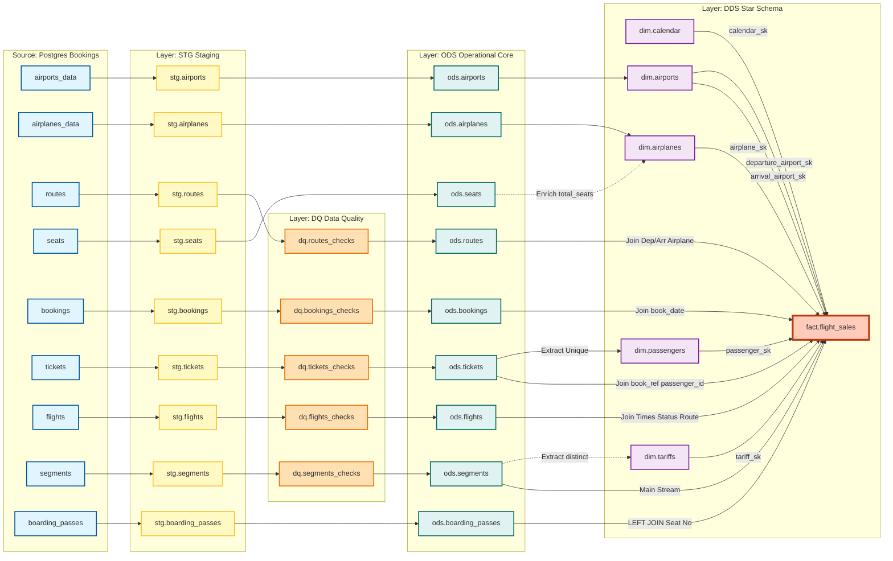

# Схема БД DWH (Bookings → Greenplum)

> **Статус:** Проект в разработке. Реализован только STG слой (частично: bookings, tickets).

## Обзор

Эта документация описывает архитектуру хранилища данных (DWH) для учебного проекта Airflow + Greenplum. Источник данных — демо-БД `bookings` (Postgres).

### Ключевые договорённости (для LLM и студентов)

- **Источник**: используем основные таблицы схемы `bookings` (табличные данные, не `VIEW`).
- **Зерно факта `fact.flight_sales`**: 1 строка = 1 сегмент билета (`ticket_no` + `flight_id`, источник: `segments`).
- **Обязательная связь для аэропортов и самолёта**: `flights.route_no → routes → (departure_airport, arrival_airport, airplane_code)`.
- **Даты**: как минимум различаем `book_date` (дата покупки) и `scheduled_departure` (дата/время вылета).
- **Инкремент в STG**: для `tickets` опорная дата берётся из `bookings.book_date`, потому что в `tickets` нет собственного поля времени изменения.

### Статус реализации по слоям

| Слой | Статус | Реализовано |
|------|--------|-------------|
| **Source** | ✅ Готово | Демо-БД bookings (Postgres) |
| **STG** | ⚠️ В процессе | 2 из 9 таблиц (bookings, tickets) |
| **DQ** | ⚠️ В процессе | Есть скрипты для bookings и tickets |
| **ODS** | ❌ Не реализован | Планируется |
| **DDS** | ❌ Не реализован | Планируется |

---

## Полная схема потоков данных (Data Lineage)

---

## Пояснения к схеме (для студентов)

Эта диаграмма покрывает основные таблицы источника и показывает логику их трансформации. Вот на что стоит обратить внимание при обучении:

### 1. Ветка справочников (Reference Data)

* **`seats` + `airplanes` → `dim.airplanes`**: Здесь мы показываем пример **обогащения**. Таблица `seats` сама по себе в аналитике редко нужна отдельной сущностью. Мы используем её в ODS, чтобы посчитать общее количество мест (`total_seats`) и добавить это как атрибут в измерение самолётов (`dim.airplanes`).

* **`airports` → `dim.airports`**: Простой перенос (1-в-1), но в DDS мы можем добавить, например, поле `city_ru` и `city_en` как отдельные колонки, убрав JSON, который есть в источнике.

### 2. Ветка генерации измерений (Dimension Generation)

* **`tickets` → `dim.passengers`**: Это самая сложная трансформация для измерения. В источнике нет таблицы "Пассажиры". Мы должны объяснить студентам, что мы "майним" пассажиров из билетов. Важно: один и тот же пассажир может иметь разные записи с разными именами (опечатки, изменение фамилии), поэтому в проде часто делают логику SCD Type 2 для отслеживания изменений.
  - Для домашки (и первого эталонного решения) обычно достаточно **SCD Type 1**: одна актуальная запись на `passenger_id`, а SCD2 можно оставить как усложнение.

* **`segments` → `dim.tariffs`**: Таблицы тарифов физически нет в источнике, она хранится строкой (`fare_conditions`: Economy/Comfort/Business) в таблице `segments`. Мы выносим её в отдельный справочник (нормализация), чтобы в факте хранить маленький `INT` ключ, а не длинную строку.

### 3. Сборка Факта (`fact.flight_sales`)

Это центр звезды. Мы собираем его из шести ODS таблиц:

1. **`ods.segments`**: Основа (зерно факта — один полётный сегмент билета). Дает стоимость (`price`).
2. **`ods.tickets`**: Приджойниваем, чтобы получить `book_ref` и `passenger_id`.
3. **`ods.bookings`**: Приджойниваем по `book_ref`, чтобы получить `book_date` (дата покупки).
4. **`ods.flights`**: Приджойниваем, чтобы получить расписание/факт времени и статус рейса, а также `route_no` (связка на маршруты).
5. **`ods.routes`**: Приджойниваем по `route_no`, чтобы получить аэропорты вылета/прилёта и `airplane_code` (в `flights` этих полей нет напрямую).
6. **`ods.boarding_passes`**: Приджойниваем (LEFT JOIN), чтобы узнать, **сел ли пассажир реально в самолёт** и на какое место (`seat_no`). Это важный бизнес-аспект: билет куплен, но посадочный не выдан = пассажир не летел.

### 4. Почему нет `dim.bookings`?

В классической Star Schema измерения — это справочники (airports, airplanes, passengers), а факты — транзакции/события (sales, bookings). 

`bookings` — это транзакционная таблица, а не справочник. Вместо отдельного измерения `dim.bookings` мы храним:
- `book_ref` — бизнес-ключ бронирования (в факте)
- `book_date` — дата бронирования (в факте, берём из `ods.bookings` по `book_ref`)

Это позволяет отвечать на вопросы типа: *"За сколько дней до вылета люди обычно покупают билеты?"* (разница между `book_date` и датой вылета из `dim.calendar`).

### 5. Суррогатные ключи (Surrogate Keys)

В Star Schema факт должен ссылаться на суррогатные ключи (SK) измерений, а не на бизнес-ключи:

| Бизнес-ключ | Суррогатный ключ | Преимущество |
|-------------|------------------|--------------|
| `airport_code CHAR(3)` | `airport_sk INT` | Меньший размер, стабильность |
| `airplane_code TEXT` | `airplane_sk INT` | Меньший размер, стабильность |
| `passenger_id TEXT` | `passenger_sk INT` | Меньший размер, отслеживание изменений |

### 6. Слой DQ (Data Quality)

Между STG и ODS добавлен слой Data Quality для проверки качества данных. В проекте уже есть скрипты:
- `sql/stg/bookings_dq.sql`
- `sql/stg/tickets_dq.sql`

На схеме показаны примеры проверок для всех таблиц, которые должны быть реализованы.

---

## История изменений

| Дата | Версия | Описание изменений |
|------|--------|-------------------|
| 2025-01-17 | 1.1 | Исправлены названия таблиц (`aircrafts_data` → `airplanes_data`, `ticket_flights` → `segments`), удалено `dim.bookings`, добавлены суррогатные ключи, добавлен слой DQ, исправлены связи |
| 2025-01-XX | 1.0 | Первоначальная версия |

---

## TODO

- [ ] Реализовать STG слой полностью (все 9 таблиц)
- [ ] Реализовать DQ слой для всех таблиц
- [ ] Реализовать ODS слой
- [ ] Реализовать DDS слой (измерения и факт)
- [ ] Создать DAG для загрузки ODS
- [ ] Создать DAG для загрузки DDS
