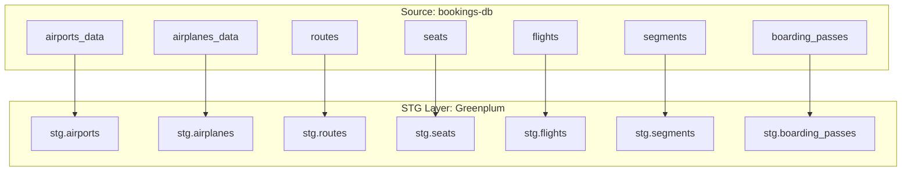

# План реализации STG слоя целиком

> **Статус:** План готов к реализации
> **Дата:** 2026-01-17
> **Автор:** Architect Mode

## Обзор задачи

Согласно [`docs/internal/db_schema.md`](../docs/internal/db_schema.md:31), STG слой реализован частично (2 из 9 таблиц: bookings, tickets). Необходимо реализовать оставшиеся 7 таблиц.

## Стратегия загрузки данных

| Тип таблиц | Стратегия | Обоснование |
|-----------|-----------|-------------|
| Справочники (airports, airplanes, routes, seats) | **Full load** | Маленький объём (<10K строк), простота реализации |
| Транзакции (flights, segments, boarding_passes) | **Инкремент по дате** | Больший объём, необходимость отслеживания изменений |

### Оценка размера справочников

| Справочник | Примерный размер | Оценка |
|-------------|------------------|---------|
| **airports** | ~700-800 аэропортов | **Маленький** |
| **airplanes** | ~10 моделей самолётов | **Крошечный** |
| **seats** | ~1700-2000 записей | **Маленький** |
| **routes** | Ожидается несколько тысяч | **Маленький/Средний** |

**Вывод:** Все справочники очень маленькие (до нескольких тысяч строк). Даже если routes будет 5000-10000 строк - это всё равно минимальный объём для Greenplum.

## Список таблиц для реализации

| Таблица источника | Таблица STG | Тип данных | Стратегия загрузки | Опорное поле для инкремента |
|-------------------|-------------|------------|-------------------|---------------------------|
| `bookings.airports_data` | `stg.airports` | Справочник | Full | - |
| `bookings.airplanes_data` | `stg.airplanes` | Справочник | Full | - |
| `bookings.routes` | `stg.routes` | Справочник | Full | - |
| `bookings.seats` | `stg.seats` | Справочник | Full | - |
| `bookings.flights` | `stg.flights` | Транзакции | Инкремент | `scheduled_departure` |
| `bookings.segments` | `stg.segments` | Транзакции | Инкремент | `book_date` (через tickets) |
| `bookings.boarding_passes` | `stg.boarding_passes` | Транзакции | Инкремент | `book_date` (через tickets) |

## Паттерн реализации (на основе bookings/tickets)

Для каждой таблицы создаются 3 файла:

1. **`sql/stg/{table}_ddl.sql`** - DDL для внешней и внутренней таблиц
2. **`sql/stg/{table}_load.sql`** - Загрузка (full или инкремент)
3. **`sql/stg/{table}_dq.sql`** - Проверки качества данных

### Общая структура DDL файла

```sql
-- DDL для слоя STG по таблице {table}.
-- Используется как из общего скрипта ddl_gp.sql (через \i),
-- так и может выполняться отдельно при изменении схемы.

-- Схема stg для сырого слоя DWH.
CREATE SCHEMA IF NOT EXISTS stg;

-- Внешняя таблица в схеме stg для чтения данных из bookings.{table} через PXF.
DROP EXTERNAL TABLE IF EXISTS stg.{table}_ext;
CREATE EXTERNAL TABLE stg.{table}_ext (
    -- поля из источника
)
LOCATION ('pxf://bookings.{table}?PROFILE=JDBC&SERVER=bookings-db')
FORMAT 'CUSTOM' (formatter='pxfwritable_import');

-- Внутренняя таблица stg.{table} — сырой слой, все бизнес-колонки как TEXT.
CREATE TABLE IF NOT EXISTS stg.{table} (
    -- бизнес-колонки как TEXT
    src_created_at_ts TIMESTAMP,
    load_dttm TIMESTAMP NOT NULL DEFAULT now(),
    batch_id TEXT NOT NULL
)
WITH (appendonly=true, orientation=row, compresstype=zlib, compresslevel=1)
DISTRIBUTED BY ({distribution_key});
```

### Общая структура LOAD файла (Full load для справочников)

```sql
-- Загрузка всех строк из stg.{table}_ext в stg.{table}.
-- Используем batch_id для отслеживания загрузки.

INSERT INTO stg.{table} (
    -- бизнес-колонки
    src_created_at_ts,
    load_dttm,
    batch_id
)
SELECT
    ext.{field}::text,
    now()::timestamp,
    '{{ run_id }}'::text
FROM stg.{table}_ext AS ext
WHERE NOT EXISTS (
    -- Защита от дублей в рамках одного batch_id
    SELECT 1
    FROM stg.{table} AS t
    WHERE t.batch_id = '{{ run_id }}'::text
        AND t.{pk} = ext.{pk}::text
);

-- Обновляем статистику для оптимизатора Greenplum
ANALYZE stg.{table};
```

### Общая структура LOAD файла (Инкремент для транзакций)

```sql
-- Загрузка инкремента из stg.{table}_ext в stg.{table}.
-- Окно инкремента определяется по src_created_at_ts:
-- берём строки, где {increment_field} больше максимального src_created_at_ts
-- среди "старых" батчей; верхняя граница по дате не используется.

-- CTE для определения максимальной даты загрузки предыдущего батча
WITH max_batch_ts AS (
    SELECT COALESCE(MAX(src_created_at_ts), TIMESTAMP '1900-01-01 00:00:00') AS max_ts
    FROM stg.{table}
    WHERE batch_id <> '{{ run_id }}'::text
        OR batch_id IS NULL
)
INSERT INTO stg.{table} (
    -- бизнес-колонки
    src_created_at_ts,
    load_dttm,
    batch_id
)
SELECT
    ext.{field}::text,
    ext.{increment_field}::timestamp,
    now(),
    '{{ run_id }}'::text
FROM stg.{table}_ext AS ext
CROSS JOIN max_batch_ts AS mb
WHERE ext.{increment_field} > mb.max_ts
AND NOT EXISTS (
    SELECT 1
    FROM stg.{table} AS t
    WHERE t.batch_id = '{{ run_id }}'::text
        AND t.{pk} = ext.{pk}::text
);

-- Обновляем статистику для оптимизатора Greenplum
ANALYZE stg.{table};
```

### Общая структура DQ файла

```sql
-- Проверки качества данных для {table}

DO $$
DECLARE
    v_batch_id TEXT := '{{ run_id }}'::text;
    v_prev_ts TIMESTAMP;
    v_src_count BIGINT;
    v_stg_count BIGINT;
    v_dup_count BIGINT;
    v_null_count BIGINT;
    -- другие переменные для специфических проверок
BEGIN
    -- Опорная метка: максимум src_created_at_ts среди предыдущих батчей
    SELECT max(src_created_at_ts)
    INTO v_prev_ts
    FROM stg.{table}
    WHERE batch_id <> v_batch_id
        OR batch_id IS NULL;

    -- Источник: считаем строки во внешней таблице, которые вошли в окно инкремента
    SELECT COUNT(*)
    INTO v_src_count
    FROM stg.{table}_ext
    WHERE {increment_field} > COALESCE(v_prev_ts, TIMESTAMP '1900-01-01 00:00:00');

    IF v_src_count = 0 THEN
        RAISE EXCEPTION
            'В источнике {table}_ext нет строк для окна инкремента.';
    END IF;

    -- Считаем строки, реально вставленные в stg.{table} в этом батче
    SELECT COUNT(*)
    INTO v_stg_count
    FROM stg.{table}
    WHERE batch_id = v_batch_id;

    IF v_src_count <> v_stg_count THEN
        RAISE EXCEPTION
            'DQ FAILED: несовпадение количества строк. Источник: %, STG: %',
            v_src_count,
            v_stg_count;
    END IF;

    -- Проверка на дубликаты первичного ключа
    SELECT COUNT(*) - COUNT(DISTINCT {pk})
    INTO v_dup_count
    FROM stg.{table} AS t
    WHERE t.batch_id = v_batch_id;

    IF v_dup_count <> 0 THEN
        RAISE EXCEPTION
            'DQ FAILED: найдены дубликаты {pk} (batch_id=%): %',
            v_batch_id,
            v_dup_count;
    END IF;

    -- Проверка обязательных полей
    SELECT COUNT(*)
    INTO v_null_count
    FROM stg.{table} AS t
    WHERE t.batch_id = v_batch_id
        AND (t.{required_field} IS NULL OR t.{required_field} = '');

    IF v_null_count <> 0 THEN
        RAISE EXCEPTION
            'DQ FAILED: найдены строки с NULL в обязательных полях (batch_id=%): %',
            v_batch_id,
            v_null_count;
    END IF;

    RAISE NOTICE
        'DQ PASSED: {table} ок (batch_id=%): source=% stg=%',
        v_batch_id,
        v_src_count,
        v_stg_count;
END $$;
```

## Детали реализации по таблицам

### 1. airports (справочник, full load)

**Внешняя таблица**: `stg.airports_ext`
- Поля: `airport_code`, `airport_name` (JSONB), `city` (JSONB), `country` (JSONB), `coordinates`, `timezone`
- PXF: `pxf://bookings.airports_data?PROFILE=JDBC&SERVER=bookings-db`

**Внутренняя таблица**: `stg.airports`
- Бизнес-колонки как TEXT:
  - `airport_code TEXT`
  - `airport_name TEXT`
  - `city TEXT`
  - `country TEXT`
  - `coordinates TEXT`
  - `timezone TEXT`
- Тех.колонки: `src_created_at_ts`, `load_dttm`, `batch_id`
- Распределение: `DISTRIBUTED BY (airport_code)`
- Обоснование: `airport_code` — это уникальный идентификатор аэропорта

**Загрузка**: Full (все строки при каждом запуске)

**DQ проверки**:
- Count между источником и STG
- Дубликаты `airport_code`
- NULL обязательных полей (airport_code, airport_name, city, timezone)

### 2. airplanes (справочник, full load)

**Внешняя таблица**: `stg.airplanes_ext`
- Поля: `airplane_code`, `model` (JSONB), `range`, `speed`
- PXF: `pxf://bookings.airplanes_data?PROFILE=JDBC&SERVER=bookings-db`

**Внутренняя таблица**: `stg.airplanes`
- Бизнес-колонки как TEXT:
  - `airplane_code TEXT`
  - `model TEXT`
  - `range TEXT`
  - `speed TEXT`
- Тех.колонки: `src_created_at_ts`, `load_dttm`, `batch_id`
- Распределение: `DISTRIBUTED BY (airplane_code)`
- Обоснование: `airplane_code` — это уникальный идентификатор самолёта

**Загрузка**: Full

**DQ проверки**:
- Count между источником и STG
- Дубликаты `airplane_code`
- NULL обязательных полей (airplane_code, model)

### 3. routes (справочник, full load)

**Внешняя таблица**: `stg.routes_ext`
- Поля: `route_no`, `validity` (tstzrange), `departure_airport`, `arrival_airport`, `airplane_code`, `days_of_week` (int[]), `scheduled_time`, `duration`
- PXF: `pxf://bookings.routes?PROFILE=JDBC&SERVER=bookings-db`

**Внутренняя таблица**: `stg.routes`
- Бизнес-колонки как TEXT:
  - `route_no TEXT`
  - `validity TEXT`
  - `departure_airport TEXT`
  - `arrival_airport TEXT`
  - `airplane_code TEXT`
  - `days_of_week TEXT`
  - `scheduled_time TEXT`
  - `duration TEXT`
- Тех.колонки: `src_created_at_ts`, `load_dttm`, `batch_id`
- Распределение: `DISTRIBUTED BY (route_no)`
- Обоснование: `route_no` — это уникальный идентификатор маршрута

**Загрузка**: Full

**DQ проверки**:
- Count между источником и STG
- Дубликаты `route_no`
- NULL обязательных полей (route_no, departure_airport, arrival_airport, airplane_code)
- Ссылочная целостность на airports (departure_airport, arrival_airport)
- Ссылочная целостность на airplanes (airplane_code)

### 4. seats (справочник, full load)

**Внешняя таблица**: `stg.seats_ext`
- Поля: `airplane_code`, `seat_no`, `fare_conditions`
- PXF: `pxf://bookings.seats?PROFILE=JDBC&SERVER=bookings-db`

**Внутренняя таблица**: `stg.seats`
- Бизнес-колонки как TEXT:
  - `airplane_code TEXT`
  - `seat_no TEXT`
  - `fare_conditions TEXT`
- Тех.колонки: `src_created_at_ts`, `load_dttm`, `batch_id`
- Распределение: `DISTRIBUTED BY (airplane_code)`
- Обоснование: co-location с airplanes для оптимизации JOIN

**Загрузка**: Full

**DQ проверки**:
- Count между источником и STG
- Дубликаты `(airplane_code, seat_no)`
- NULL обязательных полей (airplane_code, seat_no, fare_conditions)
- Ссылочная целостность на airplanes (airplane_code)

### 5. flights (транзакции, инкремент)

**Внешняя таблица**: `stg.flights_ext`
- Поля: `flight_id`, `route_no`, `status`, `scheduled_departure`, `scheduled_arrival`, `actual_departure`, `actual_arrival`
- PXF: `pxf://bookings.flights?PROFILE=JDBC&SERVER=bookings-db`

**Внутренняя таблица**: `stg.flights`
- Бизнес-колонки как TEXT:
  - `flight_id TEXT`
  - `route_no TEXT`
  - `status TEXT`
  - `scheduled_departure TEXT`
  - `scheduled_arrival TEXT`
  - `actual_departure TEXT`
  - `actual_arrival TEXT`
- Тех.колонки: `src_created_at_ts`, `load_dttm`, `batch_id`
- `src_created_at_ts` = `scheduled_departure`
- Распределение: `DISTRIBUTED BY (flight_id)`
- Обоснование: `flight_id` — это уникальный идентификатор рейса

**Загрузка**: Инкремент по `scheduled_departure`

**DQ проверки**:
- Count между источником и STG
- Дубликаты `flight_id`
- NULL обязательных полей (flight_id, route_no, status, scheduled_departure)
- Ссылочная целостность на routes (route_no)

### 6. segments (транзакции, инкремент)

**Внешняя таблица**: `stg.segments_ext`
- Поля: `ticket_no`, `flight_id`, `fare_conditions`, `price`
- PXF: `pxf://bookings.segments?PROFILE=JDBC&SERVER=bookings-db`

**Внутренняя таблица**: `stg.segments`
- Бизнес-колонки как TEXT:
  - `ticket_no TEXT`
  - `flight_id TEXT`
  - `fare_conditions TEXT`
  - `price TEXT`
- Тех.колонки: `src_created_at_ts`, `load_dttm`, `batch_id`
- `src_created_at_ts` = берётся из `bookings.book_date` через JOIN с tickets
- Распределение: `DISTRIBUTED BY (ticket_no)`
- Обоснование: co-location с tickets для оптимизации JOIN

**Загрузка**: Инкремент по `book_date` (как в tickets)

**DQ проверки**:
- Count между источником и STG
- Дубликаты `(ticket_no, flight_id)`
- NULL обязательных полей (ticket_no, flight_id, fare_conditions, price)
- Ссылочная целостность на tickets (ticket_no)
- Ссылочная целостность на flights (flight_id)

### 7. boarding_passes (транзакции, инкремент)

**Внешняя таблица**: `stg.boarding_passes_ext`
- Поля: `ticket_no`, `flight_id`, `seat_no`, `boarding_no`, `boarding_time`
- PXF: `pxf://bookings.boarding_passes?PROFILE=JDBC&SERVER=bookings-db`

**Внутренняя таблица**: `stg.boarding_passes`
- Бизнес-колонки как TEXT:
  - `ticket_no TEXT`
  - `flight_id TEXT`
  - `seat_no TEXT`
  - `boarding_no TEXT`
  - `boarding_time TEXT`
- Тех.колонки: `src_created_at_ts`, `load_dttm`, `batch_id`
- `src_created_at_ts` = берётся из `bookings.book_date` через JOIN с tickets
- Распределение: `DISTRIBUTED BY (ticket_no)`
- Обоснование: co-location с tickets/segments для оптимизации JOIN

**Загрузка**: Инкремент по `book_date` (как в tickets)

**DQ проверки**:
- Count между источником и STG
- Дубликаты `(ticket_no, flight_id)`
- NULL обязательных полей (ticket_no, flight_id)
- Ссылочная целостность на tickets (ticket_no)
- Ссылочная целостность на segments (ticket_no, flight_id)

## Обновление существующих DAG

### `airflow/dags/bookings_stg_ddl.py`

Добавить задачи для создания DDL новых таблиц:

```python
apply_stg_airports_ddl = PostgresOperator(
    task_id="apply_stg_airports_ddl",
    postgres_conn_id=GREENPLUM_CONN_ID,
    sql="stg/airports_ddl.sql",
)

apply_stg_airplanes_ddl = PostgresOperator(
    task_id="apply_stg_airplanes_ddl",
    postgres_conn_id=GREENPLUM_CONN_ID,
    sql="stg/airplanes_ddl.sql",
)

apply_stg_routes_ddl = PostgresOperator(
    task_id="apply_stg_routes_ddl",
    postgres_conn_id=GREENPLUM_CONN_ID,
    sql="stg/routes_ddl.sql",
)

apply_stg_seats_ddl = PostgresOperator(
    task_id="apply_stg_seats_ddl",
    postgres_conn_id=GREENPLUM_CONN_ID,
    sql="stg/seats_ddl.sql",
)

apply_stg_flights_ddl = PostgresOperator(
    task_id="apply_stg_flights_ddl",
    postgres_conn_id=GREENPLUM_CONN_ID,
    sql="stg/flights_ddl.sql",
)

apply_stg_segments_ddl = PostgresOperator(
    task_id="apply_stg_segments_ddl",
    postgres_conn_id=GREENPLUM_CONN_ID,
    sql="stg/segments_ddl.sql",
)

apply_stg_boarding_passes_ddl = PostgresOperator(
    task_id="apply_stg_boarding_passes_ddl",
    postgres_conn_id=GREENPLUM_CONN_ID,
    sql="stg/boardings_ddl.sql",
)
```

Зависимости:
- Сначала создаются справочники (airports, airplanes, routes, seats)
- Затем транзакционные таблицы (flights, segments, boarding_passes)

### `airflow/dags/bookings_to_gp_stage.py`

Добавить задачи для загрузки новых таблиц:

```python
# Загрузка справочников (full load)
load_airports_to_stg = PostgresOperator(
    task_id="load_airports_to_stg",
    postgres_conn_id=GREENPLUM_CONN_ID,
    sql="stg/airports_load.sql",
)

check_airports_dq = PostgresOperator(
    task_id="check_airports_dq",
    postgres_conn_id=GREENPLUM_CONN_ID,
    sql="stg/airports_dq.sql",
)

load_airplanes_to_stg = PostgresOperator(
    task_id="load_airplanes_to_stg",
    postgres_conn_id=GREENPLUM_CONN_ID,
    sql="stg/airplanes_load.sql",
)

check_airplanes_dq = PostgresOperator(
    task_id="check_airplanes_dq",
    postgres_conn_id=GREENPLUM_CONN_ID,
    sql="stg/airplanes_dq.sql",
)

load_routes_to_stg = PostgresOperator(
    task_id="load_routes_to_stg",
    postgres_conn_id=GREENPLUM_CONN_ID,
    sql="stg/routes_load.sql",
)

check_routes_dq = PostgresOperator(
    task_id="check_routes_dq",
    postgres_conn_id=GREENPLUM_CONN_ID,
    sql="stg/routes_dq.sql",
)

load_seats_to_stg = PostgresOperator(
    task_id="load_seats_to_stg",
    postgres_conn_id=GREENPLUM_CONN_ID,
    sql="stg/seats_load.sql",
)

check_seats_dq = PostgresOperator(
    task_id="check_seats_dq",
    postgres_conn_id=GREENPLUM_CONN_ID,
    sql="stg/seats_dq.sql",
)

# Загрузка транзакций (инкремент)
load_flights_to_stg = PostgresOperator(
    task_id="load_flights_to_stg",
    postgres_conn_id=GREENPLUM_CONN_ID,
    sql="stg/flights_load.sql",
)

check_flights_dq = PostgresOperator(
    task_id="check_flights_dq",
    postgres_conn_id=GREENPLUM_CONN_ID,
    sql="stg/flights_dq.sql",
)

load_segments_to_stg = PostgresOperator(
    task_id="load_segments_to_stg",
    postgres_conn_id=GREENPLUM_CONN_ID,
    sql="stg/segments_load.sql",
)

check_segments_dq = PostgresOperator(
    task_id="check_segments_dq",
    postgres_conn_id=GREENPLUM_CONN_ID,
    sql="stg/segments_dq.sql",
)

load_boarding_passes_to_stg = PostgresOperator(
    task_id="load_boarding_passes_to_stg",
    postgres_conn_id=GREENPLUM_CONN_ID,
    sql="stg/boardings_load.sql",
)

check_boarding_passes_dq = PostgresOperator(
    task_id="check_boarding_passes_dq",
    postgres_conn_id=GREENPLUM_CONN_ID,
    sql="stg/boardings_dq.sql",
)
```

Зависимости:
- Сначала загружаются и проверяются bookings и tickets (уже есть)
- Затем загружаются справочники (airports, airplanes, routes, seats)
- Затем загружаются транзакции (flights, segments, boarding_passes)
- В конце финальный лог

### Обновление `sql/ddl_gp.sql`

Добавить подключение новых DDL файлов:

```sql
-- DDL для слоя stg по таблицам bookings и tickets вынесены в отдельные файлы.
-- Здесь подключаем их через psql \i, чтобы сохранить единый входной скрипт.
\i stg/bookings_ddl.sql
\i stg/tickets_ddl.sql

-- DDL для новых таблиц STG слоя
\i stg/airports_ddl.sql
\i stg/airplanes_ddl.sql
\i stg/routes_ddl.sql
\i stg/seats_ddl.sql
\i stg/flights_ddl.sql
\i stg/segments_ddl.sql
\i stg/boardings_ddl.sql
```

### Добавление тестов

Обновить `tests/test_dags_smoke.py` для проверки структуры обновлённых DAG:

```python
def test_bookings_stg_ddl_dag_structure():
    dag = _load_dag("airflow.dags.bookings_stg_ddl")

    expected_tasks = {
        "apply_stg_bookings_ddl",
        "apply_stg_tickets_ddl",
        "apply_stg_airports_ddl",
        "apply_stg_airplanes_ddl",
        "apply_stg_routes_ddl",
        "apply_stg_seats_ddl",
        "apply_stg_flights_ddl",
        "apply_stg_segments_ddl",
        "apply_stg_boarding_passes_ddl",
    }
    assert expected_tasks.issubset(dag.task_dict.keys())

    # Проверка линейных зависимостей
    # ... (проверка зависимостей между задачами)
```

```python
def test_bookings_to_gp_stage_dag_structure():
    dag = _load_dag("airflow.dags.bookings_to_gp_stage")

    expected_tasks = {
        "generate_bookings_day",
        "load_bookings_to_stg",
        "check_row_counts",
        "load_tickets_to_stg",
        "check_tickets_dq",
        "load_airports_to_stg",
        "check_airports_dq",
        "load_airplanes_to_stg",
        "check_airplanes_dq",
        "load_routes_to_stg",
        "check_routes_dq",
        "load_seats_to_stg",
        "check_seats_dq",
        "load_flights_to_stg",
        "check_flights_dq",
        "load_segments_to_stg",
        "check_segments_dq",
        "load_boarding_passes_to_stg",
        "check_boarding_passes_dq",
        "finish_summary",
    }
    assert expected_tasks.issubset(dag.task_dict.keys())

    # Проверка линейных зависимостей
    # ... (проверка зависимостей между задачами)
```

### Обновление документации

Обновить статус в [`docs/internal/db_schema.md`](../docs/internal/db_schema.md:31) с "2 из 9" на "9 из 9".

Добавить описание новых таблиц в документацию.

## Диаграмма потока данных STG слоя



## Чек-лист реализации

- [ ] Создать файлы DDL для новых таблиц (7 файлов)
  - [ ] `sql/stg/airports_ddl.sql`
  - [ ] `sql/stg/airplanes_ddl.sql`
  - [ ] `sql/stg/routes_ddl.sql`
  - [ ] `sql/stg/seats_ddl.sql`
  - [ ] `sql/stg/flights_ddl.sql`
  - [ ] `sql/stg/segments_ddl.sql`
  - [ ] `sql/stg/boardings_ddl.sql`
- [ ] Создать файлы LOAD для новых таблиц (7 файлов)
  - [ ] `sql/stg/airports_load.sql`
  - [ ] `sql/stg/airplanes_load.sql`
  - [ ] `sql/stg/routes_load.sql`
  - [ ] `sql/stg/seats_load.sql`
  - [ ] `sql/stg/flights_load.sql`
  - [ ] `sql/stg/segments_load.sql`
  - [ ] `sql/stg/boardings_load.sql`
- [ ] Создать файлы DQ для новых таблиц (7 файлов)
  - [ ] `sql/stg/airports_dq.sql`
  - [ ] `sql/stg/airplanes_dq.sql`
  - [ ] `sql/stg/routes_dq.sql`
  - [ ] `sql/stg/seats_dq.sql`
  - [ ] `sql/stg/flights_dq.sql`
  - [ ] `sql/stg/segments_dq.sql`
  - [ ] `sql/stg/boardings_dq.sql`
- [ ] Обновить DAG `bookings_stg_ddl.py`
- [ ] Обновить DAG `bookings_to_gp_stage.py`
- [ ] Обновить `sql/ddl_gp.sql`
- [ ] Добавить тесты для новых DAG в `tests/test_dags_smoke.py`
- [ ] Обновить документацию `docs/internal/db_schema.md`
- [ ] Провести тестирование реализации

## Примечания для реализации

1. **Именование файлов**: Использовать `{table}_ddl.sql`, `{table}_load.sql`, `{table}_dq.sql`
2. **Ключи распределения**: Выбирать ключи с высокой кардинальностью для равномерного распределения
3. **Co-location**: Использовать одинаковые ключи распределения для связанных таблиц (tickets, segments, boarding_passes по ticket_no)
4. **Комментарии**: Добавлять русскоязычные комментарии в SQL-файлы для студентов
5. **DQ проверки**: Все проверки должны падать с `RAISE EXCEPTION` при ошибке
6. **Batch ID**: Использовать `{{ run_id }}` для идентификации батча
7. **Защита от дублей**: Использовать `NOT EXISTS` для предотвращения дублирования в рамках одного batch_id

## Связанные документы

- [`docs/internal/db_schema.md`](../docs/internal/db_schema.md) - Общая схема Б DWH
- [`docs/internal/bookings_stg_design.md`](../docs/internal/bookings_stg_design.md) - Детальный дизайн STG для bookings
- [`sql/stg/bookings_ddl.sql`](../sql/stg/bookings_ddl.sql) - Образец DDL
- [`sql/stg/bookings_load.sql`](../sql/stg/bookings_load.sql) - Образец LOAD
- [`sql/stg/bookings_dq.sql`](../sql/stg/bookings_dq.sql) - Образец DQ
- [`airflow/dags/bookings_stg_ddl.py`](../airflow/dags/bookings_stg_ddl.py) - Образец DAG DDL
- [`airflow/dags/bookings_to_gp_stage.py`](../airflow/dags/bookings_to_gp_stage.py) - Образец DAG загрузки
